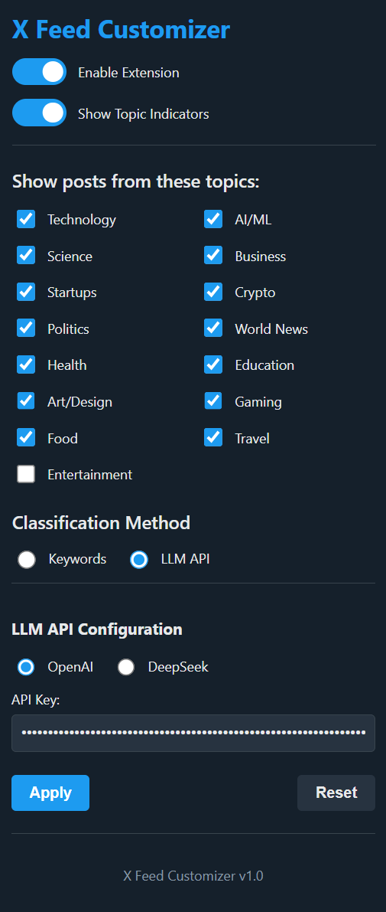

# X Feed Customizer

A Chrome extension that helps you filter your X (formerly Twitter) feed based on content topics.

## Features

- **Topic-Based Filtering**: Show only posts from topics you're interested in
- **Visual Topic Indicators**: See what category each post belongs to with color-coded labels
- **LLM-Powered Classification**: Uses OpenAI or DeepSeek models to accurately categorize posts
- **Customizable Settings**: Enable/disable specific topics to create your ideal feed
- **Lightweight**: Minimal impact on browsing performance

## Screenshots

### Extension Popup

### X Feed with Topic Labels

## Installation

### From Chrome Web Store
*(Coming soon)*

### Manual Installation
1. Download or clone this repository
2. Open Chrome and go to `chrome://extensions/`
3. Enable "Developer mode" (toggle in the top right)
4. Click "Load unpacked" and select the extension folder
5. The extension icon should appear in your toolbar

## Usage

1. Click the extension icon to open the settings panel
2. Enable/disable topics you want to see in your feed
3. Enter your OpenAI or DeepSeek API key
4. Click "Apply" to save your settings
5. Browse X with a cleaner, more focused feed

## Classification Methods

### Current: LLM-Based Classification
- Requires an OpenAI or DeepSeek API key
- High accuracy for topic classification
- Handles nuanced content better
- Incurs API usage costs

### Future Release: Keyword-Based Classification
- Will work completely offline
- No API key will be required
- Zero cost solution

## Available Topics

- Technology
- AI/ML
- Science
- Business
- Startups
- Crypto
- Politics
- World News
- Health
- Education
- Art/Design
- Gaming
- Food
- Travel
- Entertainment

## Known Issues

- Topic labels may not appear when scrolling quickly through the feed
- Some content may not be filtered correctly even when the topic is unselected
- X's frequent DOM updates can occasionally break the extension

## Privacy

This extension:
- Does not collect any personal data
- Does not track your browsing history
- When using LLM classification, post text is sent to the selected API provider

## Contributing

Contributions are welcome! Please feel free to submit a Pull Request.

## License

[MIT License](LICENSE)
